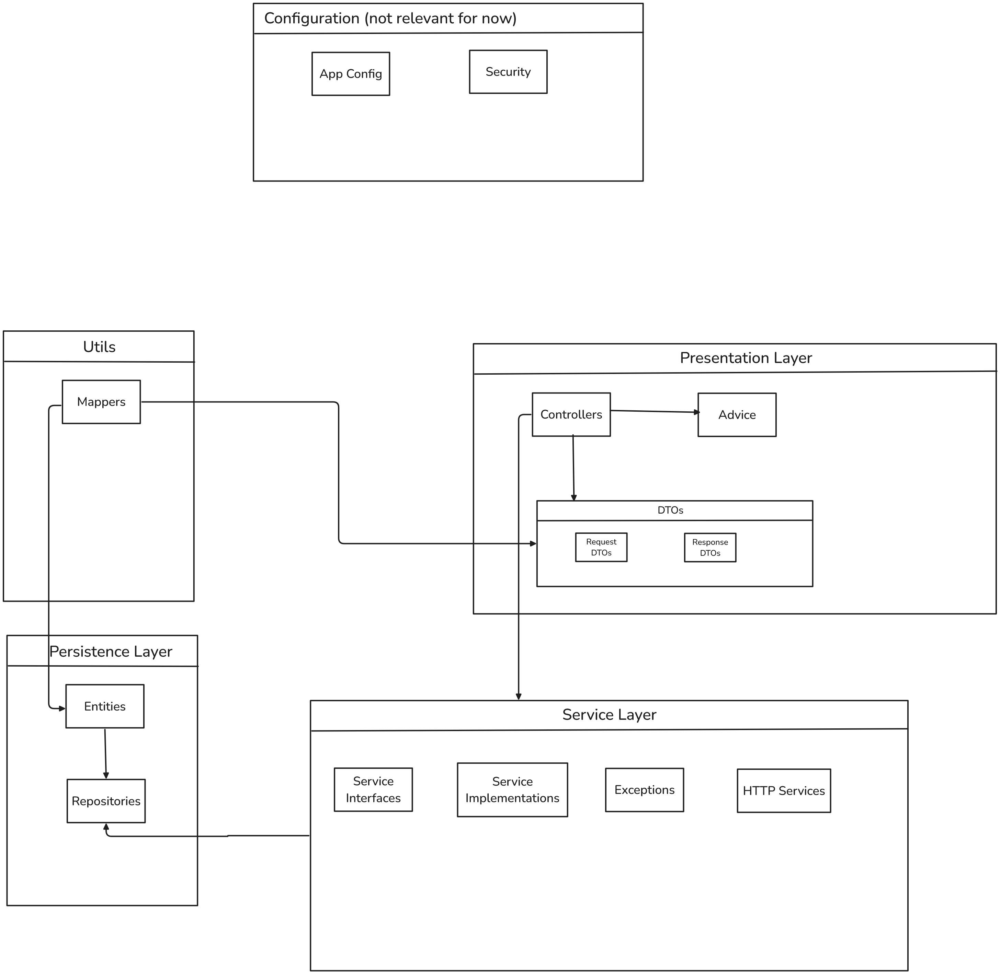

Esta estructura sigue el patrón de arquitectura en capas (layered architecture) típico de Spring Boot, separando claramente las responsabilidades entre persistencia, lógica de negocio y presentación. Esto facilita el mantenimiento y la escalabilidad del proyecto.

Capa de Presentación (Presentation Layer):

- Controllers: Maneja las peticiones HTTP
- DTOs: Objetos de transferencia de datos (Request y Response)
- Advice: Manejo global de excepciones y respuestas

Capa de Servicio (Service Layer):

- Interfaces: Definición de contratos de servicio
- Implementaciones: Lógica de negocio
- Excepciones: Manejo de errores específicos
- Servicios HTTP: Comunicación con servicios externos

Capa de Persistencia (Persistence Layer):

- Entidades: Modelos de datos
- Repositorios: Acceso a base de datos

Configuración:

- Configuración de la aplicación
- Seguridad (JWT y filtros)

Utilidades:

- Mappers: Conversión entre DTOs y entidades